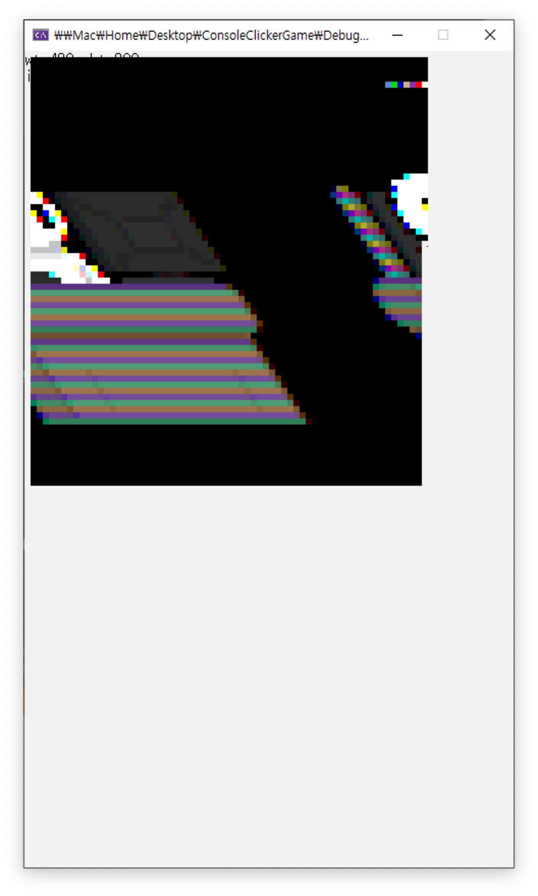

# BitmapLoader
이상하게 아무리 시도해 봐도 이미지가 안 띄워지길래 직접 구현했습니다.

## 실패



> 하지만 실패했습니다.

### 성능

우선 70*65의 작은 이미지 하나를 출력하는 데도 3초 정도 걸립니다.

비트맵 파일을 읽은 뒤, 이미지를 이루는 각각의 픽셀을 순서대로 찍어주는데요.

기존의 픽셀이 너무 작기 때문에 WINAPI의 `SetPixel()`에 대한 wrapper인 `setPixel()`을 여러 번 호출해서 픽셀 하나당 작은 정사각형으로 확대시켜 주는 `setPoint()`를 만들어 사용했습니다(모두 프로젝트 `Draw.h`에 있는 함수들입니다).

엄청난 양의 픽셀을 하나하나 찍게 되니 끔찍한 성능이 나왔습니다...

그래도 `Rect` 따위로 잘 구현하면 괜찮아질 것도 같은데, 문제는 따로 있었습니다.

### 왜곡
좌표를 뭔가 잘못 만졌는지, 아니면 파일을 잘못 로드했는지 모르지만 이미지가 중간에 뒤틀리게 됩니다.

가장 치명적인 문제는 컬러 테이블을 가져오지 않으면 24비트 이상의 색을 표현할 수 없는 것이었습니다.

삽질 끝에 결국 다시 `StretchBlt()`를 사용하는 것을 시도하기로 했습니다(이전에 작동하지 않았던 이유가 `Resources.h`에 이미지 파일 경로를 잘못 지정해서 그런 걸지도 모르겠습니다).

## 예시
누가 살려서 쓰거나 응용하시길...

```c
#include <stdio.h>
#include "Init.h"
#include "Draw.h"
#include "BitmapLoader/BitmapLoader.h"

#define TEST_IMAGE "resources/test.bmp"

int main() {
  initWindow();

  Bitmap testBmp = DEFAULT_BITMAP;
  if(testBmp.initialize(&testBmp, TEST_IMAGE)) {
    for (int y = 0; y < testBmp.height; y++) {
      for (int x = 0; x < testBmp.width; x++) {
        setPoint((testBmp.width - x), (testBmp.height - y), testBmp.getPixel(&testBmp, x, y));
      }
    }
    testBmp.terminate(&testBmp);
  }
  getchar();
}
```
